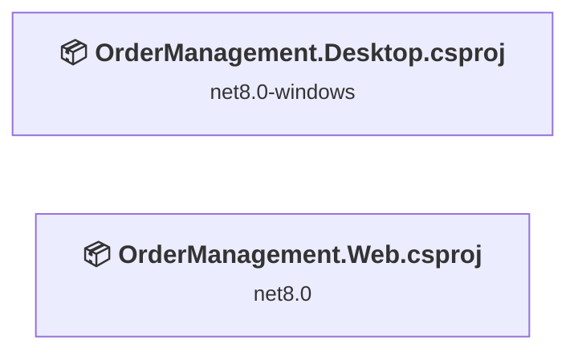
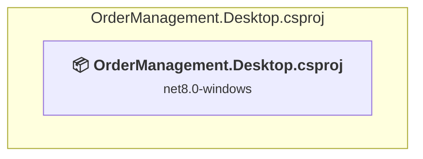
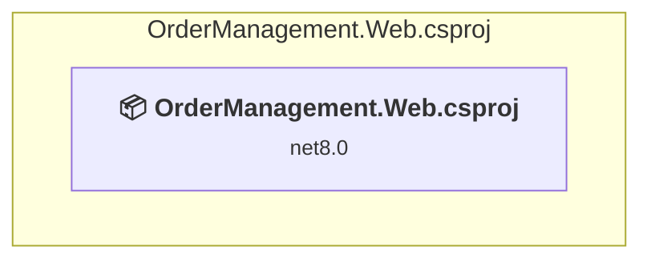

# Projects and dependencies analysis

This document provides a comprehensive overview of the projects and their dependencies in the context of upgrading to .NETCoreApp,Version=v10.0.

## Table of Contents

- [Executive Summary](#executive-Summary)
  - [Highlevel Metrics](#highlevel-metrics)
  - [Projects Compatibility](#projects-compatibility)
  - [Package Compatibility](#package-compatibility)
  - [API Compatibility](#api-compatibility)
  - [Binding Redirect Configuration](#binding-redirect-configuration)
- [Aggregate NuGet packages details](#aggregate-nuget-packages-details)
- [Top API Migration Challenges](#top-api-migration-challenges)
  - [Technologies and Features](#technologies-and-features)
  - [Most Frequent API Issues](#most-frequent-api-issues)
- [Projects Relationship Graph](#projects-relationship-graph)
- [Project Details](#project-details)

  - [src\desktop\OrderManagement.Desktop\OrderManagement.Desktop.csproj](#srcdesktopordermanagementdesktopordermanagementdesktopcsproj)
  - [src\web\OrderManagement.Web\OrderManagement.Web.csproj](#srcwebordermanagementwebordermanagementwebcsproj)

## Executive Summary

### Highlevel Metrics

| Metric | Count | Status |
| :--- | :---: | :--- |
| Total Projects | 2 | All require upgrade |
| Total NuGet Packages | 3 | 1 need upgrade |
| Total Code Files | 10 |  |
| Total Code Files with Incidents | 10 |  |
| Total Lines of Code | 609 |  |
| Total Number of Issues | 34 |  |
| Estimated LOC to modify | 31+ | at least 5,1% of codebase |

### Projects Compatibility

| Project | Target Framework | Difficulty | Package Issues | API Issues | Binding Issues | Est. LOC Impact | Description |
| :--- | :---: | :---: | :---: | :---: | :---: | :---: | :--- |
| [src\desktop\OrderManagement.Desktop\OrderManagement.Desktop.csproj](#srcdesktopordermanagementdesktopordermanagementdesktopcsproj) | net8.0-windows | 🟢 Low | 0 | 29 | 0 | 29+ | Wpf, Sdk Style = True |
| [src\web\OrderManagement.Web\OrderManagement.Web.csproj](#srcwebordermanagementwebordermanagementwebcsproj) | net8.0 | 🟢 Low | 1 | 2 | 0 | 2+ | AspNetCore, Sdk Style = True |

### Package Compatibility

| Status | Count | Percentage |
| :--- | :---: | :---: |
| ✅ Compatible | 2 | 66,7% |
| ⚠️ Incompatible | 0 | 0,0% |
| 🔄 Upgrade Recommended | 1 | 33,3% |
| ***Total NuGet Packages*** | ***3*** | ***100%*** |

### API Compatibility

| Category | Count | Impact |
| :--- | :---: | :--- |
| 🔴 Binary Incompatible | 23 | High - Require code changes |
| 🟡 Source Incompatible | 0 | Medium - Needs re-compilation and potential conflicting API error fixing |
| 🔵 Behavioral change | 8 | Low - Behavioral changes that may require testing at runtime |
| ✅ Compatible | 971 |  |
| ***Total APIs Analyzed*** | ***1002*** |  |

## Aggregate NuGet packages details

| Package | Current Version | Suggested Version | Projects | Description |
| :--- | :---: | :---: | :--- | :--- |
| CommunityToolkit.Mvvm | 8.3.2 |  | [OrderManagement.Desktop.csproj](#srcdesktopordermanagementdesktopordermanagementdesktopcsproj) | ✅Compatible |
| Microsoft.AspNetCore.OpenApi | 8.0.28 | 10.0.9 | [OrderManagement.Web.csproj](#srcwebordermanagementwebordermanagementwebcsproj) | NuGet package upgrade is recommended |
| Swashbuckle.AspNetCore | 6.6.2 |  | [OrderManagement.Web.csproj](#srcwebordermanagementwebordermanagementwebcsproj) | ✅Compatible |

## Top API Migration Challenges

### Technologies and Features

| Technology | Issues | Percentage | Migration Path |
| :--- | :---: | :---: | :--- |
| WPF (Windows Presentation Foundation) | 4 | 12,9% | WPF APIs for building Windows desktop applications with XAML-based UI that are available in .NET on Windows. WPF provides rich desktop UI capabilities with data binding and styling. Enable Windows Desktop support: Option 1 (Recommended): Target net9.0-windows; Option 2: Add <UseWindowsDesktop>true</UseWindowsDesktop>. |

### Most Frequent API Issues

| API | Count | Percentage | Category |
| :--- | :---: | :---: | :--- |
| T:System.Net.Http.HttpContent | 3 | 9,7% | Behavioral Change |
| T:System.Uri | 3 | 9,7% | Behavioral Change |
| T:System.Windows.MessageBox | 2 | 6,5% | Binary Incompatible |
| T:System.Windows.MessageBoxResult | 2 | 6,5% | Binary Incompatible |
| M:System.Windows.MessageBox.Show(System.String) | 2 | 6,5% | Binary Incompatible |
| M:System.Uri.#ctor(System.String,System.UriKind) | 2 | 6,5% | Behavioral Change |
| T:System.Windows.Application | 2 | 6,5% | Binary Incompatible |
| T:System.Windows.RoutedEventHandler | 2 | 6,5% | Binary Incompatible |
| M:System.Windows.Window.#ctor | 2 | 6,5% | Binary Incompatible |
| M:System.Windows.Markup.InternalTypeHelper.#ctor | 1 | 3,2% | Binary Incompatible |
| T:System.Windows.Markup.InternalTypeHelper | 1 | 3,2% | Binary Incompatible |
| M:System.Windows.Application.Run | 1 | 3,2% | Binary Incompatible |
| P:System.Windows.Application.StartupUri | 1 | 3,2% | Binary Incompatible |
| M:System.Windows.Application.#ctor | 1 | 3,2% | Binary Incompatible |
| E:System.Windows.Controls.Primitives.ButtonBase.Click | 1 | 3,2% | Binary Incompatible |
| M:System.Windows.Application.LoadComponent(System.Object,System.Uri) | 1 | 3,2% | Binary Incompatible |
| T:System.Windows.RoutedEventArgs | 1 | 3,2% | Binary Incompatible |
| P:System.Windows.FrameworkElement.DataContext | 1 | 3,2% | Binary Incompatible |
| T:System.Windows.Markup.IComponentConnector | 1 | 3,2% | Binary Incompatible |
| T:System.Windows.Window | 1 | 3,2% | Binary Incompatible |

## Projects Relationship Graph

Legend:
📦 SDK-style project
⚙️ Classic project

## Project Details

### src\desktop\OrderManagement.Desktop\OrderManagement.Desktop.csproj

#### Project Info

- **Current Target Framework:** net8.0-windows
- **Proposed Target Framework:** net10.0-windows
- **SDK-style**: True
- **Project Kind:** Wpf
- **Dependencies**: 0
- **Dependants**: 0
- **Number of Files**: 6
- **Number of Files with Incidents**: 8
- **Lines of Code**: 312
- **Estimated LOC to modify**: 29+ (at least 9,3% of the project)

#### Dependency Graph

Legend:
📦 SDK-style project
⚙️ Classic project

### API Compatibility

| Category | Count | Impact |
| :--- | :---: | :--- |
| 🔴 Binary Incompatible | 23 | High - Require code changes |
| 🟡 Source Incompatible | 0 | Medium - Needs re-compilation and potential conflicting API error fixing |
| 🔵 Behavioral change | 6 | Low - Behavioral changes that may require testing at runtime |
| ✅ Compatible | 579 |  |
| ***Total APIs Analyzed*** | ***608*** |  |

#### Project Technologies and Features

| Technology | Issues | Percentage | Migration Path |
| :--- | :---: | :---: | :--- |
| WPF (Windows Presentation Foundation) | 4 | 13,8% | WPF APIs for building Windows desktop applications with XAML-based UI that are available in .NET on Windows. WPF provides rich desktop UI capabilities with data binding and styling. Enable Windows Desktop support: Option 1 (Recommended): Target net9.0-windows; Option 2: Add <UseWindowsDesktop>true</UseWindowsDesktop>. |

### src\web\OrderManagement.Web\OrderManagement.Web.csproj

#### Project Info

- **Current Target Framework:** net8.0
- **Proposed Target Framework:** net10.0
- **SDK-style**: True
- **Project Kind:** AspNetCore
- **Dependencies**: 0
- **Dependants**: 0
- **Number of Files**: 9
- **Number of Files with Incidents**: 2
- **Lines of Code**: 297
- **Estimated LOC to modify**: 2+ (at least 0,7% of the project)

#### Dependency Graph

Legend:
📦 SDK-style project
⚙️ Classic project

### API Compatibility

| Category | Count | Impact |
| :--- | :---: | :--- |
| 🔴 Binary Incompatible | 0 | High - Require code changes |
| 🟡 Source Incompatible | 0 | Medium - Needs re-compilation and potential conflicting API error fixing |
| 🔵 Behavioral change | 2 | Low - Behavioral changes that may require testing at runtime |
| ✅ Compatible | 392 |  |
| ***Total APIs Analyzed*** | ***394*** |  |

