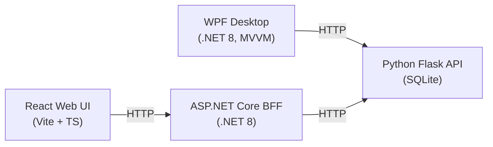

# Order Management — GitHub Copilot Modernization Demo

A deliberately **unoptimized, buggy, and insecure** multi-tier *Order Management* sample,
built as a hands-on lab for showing how **GitHub Copilot** modernizes real applications:
.NET version upgrades, data‑model changes, UI changes, performance tuning with `dotnet-trace`,
and finally containerization with Docker.

> ⚠️ **This code is intentionally bad.** SQL injection, plaintext passwords, hard-coded secrets,
> UI-thread blocking, N+1 queries and socket exhaustion are planted on purpose so the class can
> find and fix them with Copilot. **Never deploy any of this.**

---

## What's in the box

| Tier | Tech | Folder | Port |
|------|------|--------|------|
| Desktop client | **.NET 8 WPF** + CommunityToolkit.Mvvm | `src/desktop/OrderManagement.Desktop` | — |
| Web BFF / API | **.NET 8 ASP.NET Core** (minimal APIs) | `src/web/OrderManagement.Web` | `5080` |
| Web UI | **React + Vite + TypeScript** | `src/web/OrderManagement.Web/ClientApp` | `5173` (dev) |
| Core REST API | **Python 3 + Flask + SQLite** | `src/api` | `5001` |



The **Python API** is the single source of truth (customers, products, orders in SQLite).
The **WPF desktop** app talks to it directly. The **React UI** talks to the **.NET BFF**,
which aggregates/forwards to the Python API (and contains the perf hotspot for the
`dotnet-trace` exercise).

---

## Prerequisites

- **.NET SDK 9** (builds & runs the `net8.0` projects; also used for the 8 → 9 upgrade lab)
  - .NET 8 **and** 9 runtimes (Desktop + ASP.NET Core) must be present.
- **Python 3.11+**
- **Node.js 20+** (for the React UI)
- Windows (WPF is Windows-only)

---

## Run it natively (quick start)

Open **three terminals** from the repo root.

**1) Python API (port 5001)**
```powershell
cd src/api
python -m venv .venv
.\.venv\Scripts\python.exe -m pip install -r requirements.txt
.\.venv\Scripts\python.exe app.py
```

**2) .NET BFF (port 5080)**
```powershell
cd src/web/OrderManagement.Web
dotnet run
# Swagger UI: http://localhost:5080/swagger
```

**3a) WPF desktop**
```powershell
cd src/desktop/OrderManagement.Desktop
dotnet run
```

**3b) React UI (port 5173)** — once the ClientApp is set up (see `docs/`)
```powershell
cd src/web/OrderManagement.Web/ClientApp
npm install
npm run dev
```

> A convenience script `tools/run-all.ps1` starts the API + BFF together.

Smoke test the BFF:
```powershell
curl http://localhost:5080/api/products
curl http://localhost:5080/api/orders
curl http://localhost:5080/api/dashboard   # intentionally slow (dotnet-trace target)
```

---

## The modernization workshop

The whole point of this repo is the guided labs in **[`docs/`](docs/)**. They take an instructor
and class from the broken "before" state to a modernized "after" state using Copilot:

1. **.NET version upgrade** (8 → 9) with GitHub Copilot app modernization.
2. **Data‑model changes** (e.g. `double` money → `decimal`, real constraints, DTOs).
3. **UI changes** (WPF async/MVVM cleanup; React hooks/TypeScript hardening).
4. **Performance** with [`dotnet-trace`](https://learn.microsoft.com/dotnet/core/diagnostics/dotnet-trace).
5. **Agentic local delegation** (Copilot agent mode in the IDE).
6. **Agentic cloud delegation** (Copilot coding agent on GitHub).
7. **Skills & custom instructions** (`.github/` instructions that steer Copilot).
8. **Containerization** with Docker for every tier.

Per‑project, copy‑paste **prompt guidelines** live in [`docs/prompts/`](docs/prompts/), and the
**instructor / proctor guide** is [`docs/proctor-guide.md`](docs/proctor-guide.md).

References:
- GitHub Copilot app modernization for .NET — https://learn.microsoft.com/dotnet/core/porting/github-copilot-app-modernization/
- CommunityToolkit.Mvvm — https://learn.microsoft.com/dotnet/communitytoolkit/mvvm/
- dotnet-trace — https://learn.microsoft.com/dotnet/core/diagnostics/dotnet-trace

---

## Repository layout

```
OrderManagement.sln
src/
  api/                              Python Flask + SQLite REST API
  desktop/OrderManagement.Desktop/  WPF (.NET 8) + CommunityToolkit.Mvvm
  web/OrderManagement.Web/          ASP.NET Core (.NET 8) BFF
    ClientApp/                      React + Vite + TypeScript UI
docs/                               Workshop + proctor guide + prompts
tools/                              Run / helper scripts
.github/                            Copilot custom instructions & skills
```
