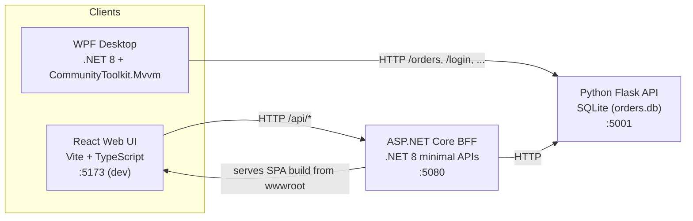
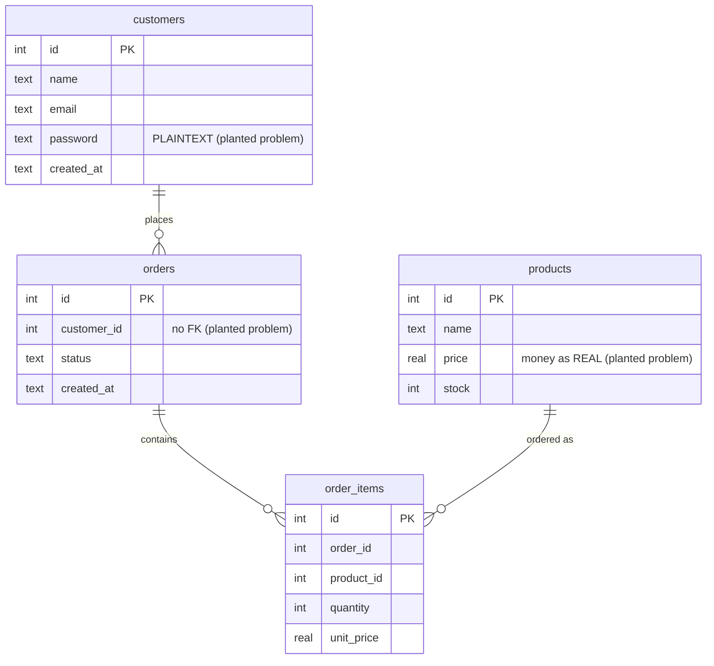

# 01 — Architecture & the planted problems

## System overview

- **Python API** (`src/api`) owns the data (SQLite `orders.db`, auto-seeded on first run).
- **WPF desktop** (`src/desktop/OrderManagement.Desktop`) calls the Python API directly.
- **React UI** (`src/web/OrderManagement.Web/ClientApp`) calls the **BFF**.
- **BFF** (`src/web/OrderManagement.Web`) aggregates/forwards to the Python API and also
  serves the built React app from `wwwroot`.

### Ports

| Service | URL |
|---------|-----|
| Python API | http://localhost:5001 |
| .NET BFF | http://localhost:5080 (Swagger at `/swagger`) |
| React dev server | http://localhost:5173 |

## Data model (SQLite)

Seeded logins: `alice@example.com` / `password123`, plus an **admin backdoor**: any login
with password `admin` succeeds.

## REST endpoints

**Python API (`:5001`)**

| Method | Path | Notes |
|--------|------|-------|
| GET | `/health` | liveness |
| POST | `/login` | SQL-injectable; admin backdoor |
| GET | `/customers`, `/customers/{id}` | leaks password column; `{id}` injectable |
| POST | `/customers` | no validation |
| GET | `/products` / POST `/products` | |
| GET | `/orders` | N+1, no pagination |
| GET | `/orders/{id}` | f-string SQL injection |
| POST | `/orders` | no transaction, no stock check |
| PUT | `/orders/{id}/status` | injectable, no allow-list |
| GET | `/search?q=` | classic query-string SQL injection |
| GET | `/reports/revenue` | deliberately slow (`time.sleep`) |

**.NET BFF (`:5080`)**

| Method | Path | Notes |
|--------|------|-------|
| GET | `/api/orders` | O(n²) enrichment join, sync-over-async |
| GET | `/api/products` | proxy |
| GET | `/api/dashboard` | **primary dotnet-trace target** (sleep + CPU burn) |
| GET | `/api/revenue` | proxies the slow Python report |
| POST | `/api/login` | forwards plaintext creds, logs them |
| PUT | `/api/orders/{id}/status` | proxy |

## Catalogue of planted problems

Search the codebase for `BAD:` to find every planted issue. Highlights:

### Python API — `src/api/app.py`, `src/api/database.py`
- **SQL injection** in `/login`, `/customers/{id}`, `/orders/{id}`, `/orders/{id}/status`, `/search`.
- **Plaintext passwords** stored and returned; **hard-coded admin backdoor**; secrets in source.
- **CORS `*`** with credentials; `debug=True`; binds `0.0.0.0`.
- **N+1 queries**, no pagination, totals recomputed per request.
- **Bare `except:`** that swallow errors and still return HTTP 200.
- Single global SQLite connection shared across threads.

### .NET BFF — `src/web/OrderManagement.Web/Services/*`, `Program.cs`
- **`new HttpClient()` per call** (socket exhaustion) — should be `IHttpClientFactory`.
- **Sync-over-async** (`.Result`) → thread-pool starvation.
- **O(n²)** order→customer join (`ReportService.GetEnrichedOrders`).
- **`Thread.Sleep` + CPU burn** in `BuildDashboardHtml` / `ComputeExpensiveChecksum`.
- **Secrets in `appsettings.json`**, **credentials logged** in `/api/login`.
- **CORS AllowAnyOrigin + AllowAnyHeader/Method**.

### WPF desktop — `src/desktop/OrderManagement.Desktop/*`
- **UI-thread blocking** (`.Result` / `.GetAwaiter().GetResult()`) in `[RelayCommand]`s and
  in the view-model **constructor**.
- **`new HttpClient()` per call**; **plaintext password** bound to the UI.
- **Business logic in code-behind** (`MainWindow.xaml.cs` `ExportButton_Click`), empty `catch`.
- ObservableCollection fully rebuilt on every refresh; money as `double`.

### React UI — `src/web/OrderManagement.Web/ClientApp/src/App.tsx`
- **Hard-coded API URL**, `any` everywhere, `fetch` with no error handling/cleanup.
- **Token in `localStorage`**, **`dangerouslySetInnerHTML`** (XSS), one giant component,
  array-index keys, totals recomputed every render.

These are the raw material for the modernization labs.
