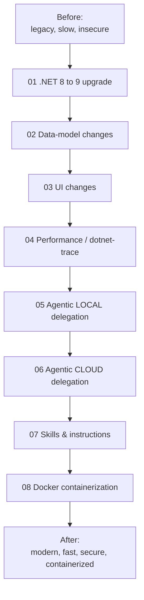

# 00 — Modernization overview

This is the map for the hands-on labs. Each lab takes a planted problem from the "before"
state and uses **GitHub Copilot** to modernize it, then verifies the result.

## The journey



> **Order matters:** we **modernize and improve first** (01–07), and only **then
> containerize** (08). Containerizing a fixed app is easy; containerizing a broken one just
> ships the bugs.

## How Copilot capabilities map to the labs

| Capability | Where it shines | Lab |
|------------|-----------------|-----|
| **GitHub Copilot app modernization for .NET** (Upgrade) | Bumping the target framework and fixing the fallout automatically | 01 |
| **Agent mode (local)** | Multi-file, multi-step edits on your machine you watch live | 02, 03, 05 |
| **Ask/Edit + inline chat** | Focused, single-file refactors with review | 02, 03 |
| **Profiling-driven fixes** | Feed `dotnet-trace` findings to Copilot for targeted optimization | 04 |
| **Copilot coding agent (cloud)** | Hand a whole issue to Copilot; it works in the cloud and opens a PR | 06 |
| **Custom instructions / prompt files / skills** | Steering Copilot's behavior to your standards | 07 |

References:
- GitHub Copilot app modernization for .NET — <https://learn.microsoft.com/dotnet/core/porting/github-copilot-app-modernization/>
- `dotnet-trace` — <https://learn.microsoft.com/dotnet/core/diagnostics/dotnet-trace>
- CommunityToolkit.Mvvm — <https://learn.microsoft.com/dotnet/communitytoolkit/mvvm/>

## Working method (use this every lab)

1. **Branch** per lab: `git switch -c lab/01-dotnet-upgrade`.
2. **Show the problem** (run it, read the `BAD:` comment).
3. **Prompt Copilot** with the matching prompt from `docs/prompts/…` (in **Agent** mode for
   multi-file labs).
4. **Review the diff** — this is the learning. Reject anything you don't understand.
5. **Verify** with the lab's Verify step + `tools/smoke-test.ps1`.
6. **Commit**: `git commit -am "lab 01: upgrade to net9.0"`.

> Keep the app **runnable after every lab**. Small steps beat big-bang rewrites.

## Finding the work

Every planted issue is tagged. To list them:
```powershell
Select-String -Path (Get-ChildItem -Recurse -Include *.py,*.cs,*.tsx,*.xaml) -Pattern "BAD:"
```

Start with **[01-dotnet-upgrade.md](01-dotnet-upgrade.md)**.
